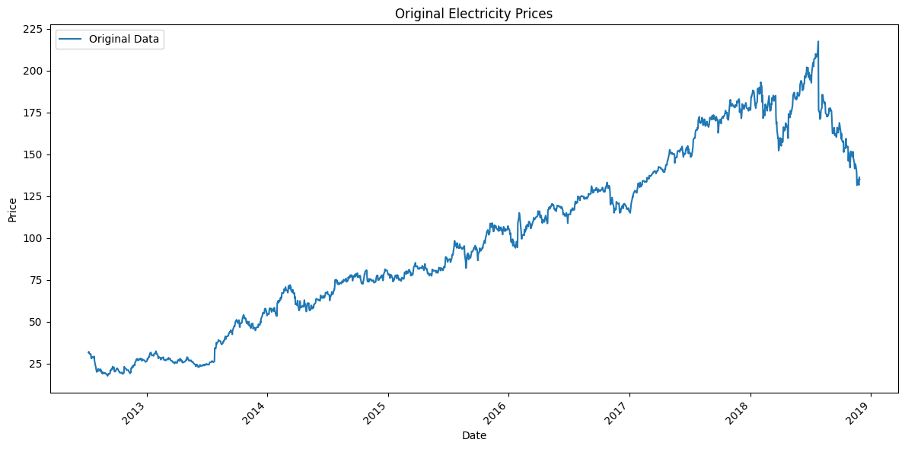
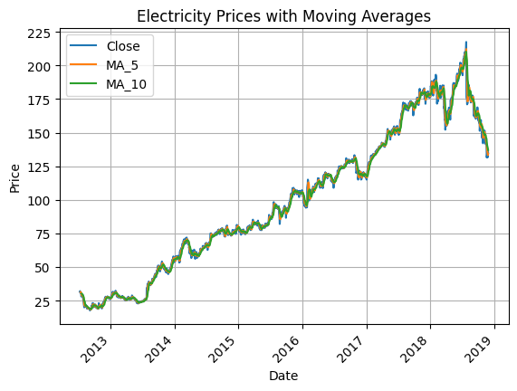
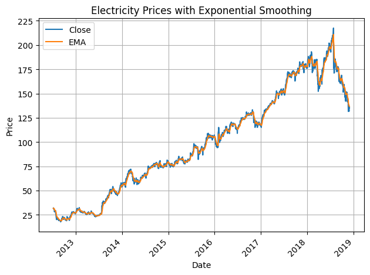

# Ex.No: 08     MOVING AVERAGE MODEL AND EXPONENTIAL SMOOTHING
### Date: 
#### NAME : KAVINRAJA D
#### REG NO : 212222240047
### AIM:
To implement Moving Average Model and Exponential smoothing Using Python.
### ALGORITHM:
1. Import necessary libraries
2. Read the AirLinePassengers data from a CSV file,Display the shape and the first 20 rows of
the dataset
3. Set the figure size for plots
4. Suppress warnings
5. Plot the first 50 values of the 'Value' column
6. Perform rolling average transformation with a window size of 5
7. Display the first 10 values of the rolling mean
8. Perform rolling average transformation with a window size of 10
9. Create a new figure for plotting,Plot the original data and fitted value
10. Show the plot
11. Also perform exponential smoothing and plot the graph
### PROGRAM:
#### Import the packages
```py
import pandas as pd
import matplotlib.pyplot as plt
```
#### Read the Airline Passengers dataset from a CSV file
```py
data = pd.read_csv("FB.csv", index_col="Date", parse_dates=True)
```
#### Display the shape and the first 50 rows of the dataset
```py
print(f"Data shape: {data.shape}")
print(data.head(50))
```
#### Plot the first 50 values of the 'Close' column
```py
plt.figure(figsize=(12, 6))
data["Close"].plot(label="Original Data")
plt.title("Original Electricity Prices")
plt.xlabel("Date")
plt.ylabel("Price")
plt.legend()
plt.xticks(rotation=45)
plt.tight_layout()
plt.show()
```
#### Perform rolling average transformation with a window size of 5
```py
rolling_mean_5 = data['Close'].rolling(window=5).mean()
```
#### Display the first 10 values of the rolling mean
```py
print("First 10 values of the rolling mean with window size 5:")
print(rolling_mean_5.head(10))
```
#### Perform rolling average transformation with a window size of 10
```py
rolling_mean_10 = data['Close'].rolling(window=10).mean()
```
#### Perform MA with window size 5 and 10
```py

window_sizes = [5, 10]

for window in window_sizes:
  data["MA_" + str(window)] = data["Close"].rolling(window=window).mean()

print(f"\nMoving Average (Window {window_sizes[0]}): {data['MA_' + str(window_sizes[0])].head(10)}")
print(f"Moving Average (Window {window_sizes[1]}): {data['MA_' + str(window_sizes[1])].head(10)}")

```
#### Plot Output of MA vs Original Data
```py
plt.figure(figsize=(12, 6))

data[["Close", "MA_" + str(window_sizes[0]), "MA_" + str(window_sizes[1])]].plot()
plt.title("Electricity Prices with Moving Averages")
plt.xlabel("Date")
plt.ylabel("Price")
plt.grid(True)
plt.legend()
plt.xticks(rotation=45)
plt.show()
```
#### Perfomr ES 
```py
alpha = 0.2

data["EMA"] = data["Close"].ewm(alpha=alpha, min_periods=0, adjust=False).mean()
```
####  Plot Output of ES  vs Original Data
```py
data[["Close", "EMA"]].plot()
plt.title("Electricity Prices with Exponential Smoothing")
plt.xlabel("Date")
plt.ylabel("Price")
plt.grid("True")
plt.legend()
plt.xticks(rotation=45)
plt.tight_layout()
plt.show()
```
### OUTPUT:
#### Plot the original data

#### Plot the original data and fitted value of MA


#### Plot the original data and fitted value of EM


### RESULT:
Thus we have successfully implemented the Moving Average Model and Exponential smoothing using python.
